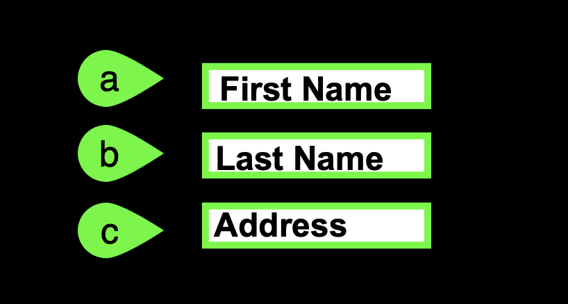

This is the first page folks will seen when they link to your content. It is the index.md file in the top level of the docs directory in the source repository and is generated by **mkdocs create**.

This will typically have a good introduction, links back to YourLearning and learn.ibm.com for partners, and provide a summary of what the users will be doing. 

For IBM Cloud, the following sections are included:

## Support

!!! Danger "Potential conflict with current Sales Enablement Center of Excellence (COE)"

    The current COE says, "Do not include author names and contact info for client-facing labs". If you are creating a client-facing lab, you should not include your contact. You should include information for accessing the appropriate support mechanism. 

    For IBM Cloud L3's the author e-mail address has been included. This expedites support, but may need to be reconsidered.

Think something is down? Check the applicable status pages for current updates:

-  <a href="https://techzone.status.io/" target="_blank">IBM Technology Zone</a>
-  <a href="https://cloud.ibm.com/status" target="_blank">IBM Cloud</a>

For issues with provisioning or accessing the environment in IBM Technology Zone (ITZ) open a ticket with ITZ support:

-  Web: <a href="https://ibmsf.force.com/ibminternalproducts/s/createrecord/NewCase?language=en_US" target="_blank">IBM Technology Zone</a>
-  Email: <a href="mailto:techzone.help@ibm.com" target="_blank">techzone.help.ibm.com</a>

For issues related to specific steps found in the demonstration guide after the ITZ environment is provisioned, contact the authors:

-  Slack: <a href="{{supportSlack.url}}" target="_blank">{{supportSlack.name}}</a> - IBM only
-  Email: <a href="{{supportEmail}}" target="_blank">{{supportEmail}}</a>

Business Partners can also use the IBM Training live Chat Support service or other support methods that are found on the IBM Training portal <a href="https://ibmcpsprod.service-now.com/its?id=sc_category&sys_id=6568bfafdb2f13008ea7d6fa4b961990" target="_blank">here</a>.

## Using the demonstration guide

The {{guide.name}} is organized in parts and chapters. Most chapters contain numbered steps.

Throughout the guide, images are used as examples of the IBM Cloud Portal, IBM Cloud Shell, and PowerVS instance consoles.

!!! Warning
    The IBM Cloud Portal and {{offering.name}} changes regularly and can differ from the images that are captured here.

In most images, the following styles of highlighting are used:

- Action highlight box: illustrates where to click, enter, or select an item:

    

- Numbered action highlight box: illustrates where to click, enter, or select items and the order in which they should be processed:

    
    

    !!! Danger "Conflict with current Sales Enablement Center of Excellence (COE)"

        The COE states "Circled uppercase letters are used as image callouts to show where to perform the action and the same letter is shown in bold in the instructions."

        This should be revisited.

        1. If doing numbered step-by-step instructions, a number should be used to correspond with the step. 
        2. If depicting sub-steps that are lettered, then a letter should be used to aligns with the instructions - either capital or lower case.

        The COE is a little inconsistent as it first says to use red and then says to use contrasting color for labels. For consistency, it should be *contrasting color* from the screen capture. In my opinion, this actually should not be *red*, especially when signalling an action that should be performed. *Red* is the universal color for stop which makes is use counter intuitive.

        COE also calls out using specific thickness (2.25 points) and size (0.91cm circle) of highlights and numbers. This should probably be more flexible and based upon the resolution of the image and what needs to be highlighted. The above sizes may have been specified given a specific font size. On-line directions need more flexibility.

        COE also says to use a circle for numbered circles. Would suggest using a shape (like shown above) that provides more positional direction especially when there is a need to avoid covering certain aspects of the UI.

- Explore more highlight box: illustrates one of two things:

    - the path to follow to get to a specific location in the user interface
    - areas to explore

    

- Copy to the clipboard box: The text is copied to the clipboard. Click the copy icon and then paste with the operating system's paste function. For example, entering ++ctrl++**+v**, ++cmd++**+v**, or right click and select paste.

    

    !!! Danger "Conflict with current Sales Enablement Center of Excellence (COE)"

        COE specifies "No inline icons are used in the text because they do not show th context and location." 

        I believe that is only one use case where in-line icons can be used. I believe they can be quite effective as shown in the paragraph for copy keyboard shortcut. It is also useful to identify elements of a UI elements that are small. When doing so, they should also be highlighted in the image as well.

        As an example:

            Click the **Configure for Epic workloads** information icon () and read the helpful information.
        

Several "click through" demonstrations are included. Links to click through demonstrations open in a new browser window or tab.

Click **play**  in the middle of the screen to start the demo. Then, follow the steps in the demonstration guide. Not sure where to click or what to do next? Click anywhere on the screen and the spot to click next is highlighted.

Just a reminder, **in this demonstration environment, full access to the IBM Cloud account is NOT provided.** User identifications (IDs) are restricted to specific capabilities. Permission to create or modify PowerVS service instances, virtual machines (instances), networks, images, and so on, is not provided.

!!! Warning
    Attempting to perform an action without the appropriate permissions results in an error message like the one that follows. This error is not an issue with IBM Cloud or PowerVS, rather a restriction of the demo environment and the permissions assigned to users.

    
    
## Acronyms

The following acronyms are used throughout this demonstration guide:

    - Application programming interfaces (APIs)
    - Classless inter-domain routing (CIDR)
    - Control (ctrl) - The control key on keyboard
    - Command (cmd) - The command key on keyboard
    - Disaster recovery (DR)
    - Gigabyte (GB)
    - High availability (HA)
    - IBM Cloud Object Storage (COS)
    - IBM Power Virtual Server (PowerVS)
    - IBM Technology Zone (TechZone)
    - Infrastructure as a Service (IaaS)
    - Input/output operations per second (IOPs)
    - Internet protocol (IP)
    - Operating system (OS)
    - Random access memory (RAM)
    - Reliability, Availability, and Serviceability (RAS)
    - Secure Socket Shell (SSH)
    - User identification (ID)
    - Virtual machine (VM)

It is now time to proceed to Part 1, an overview of {{offering.name}}.